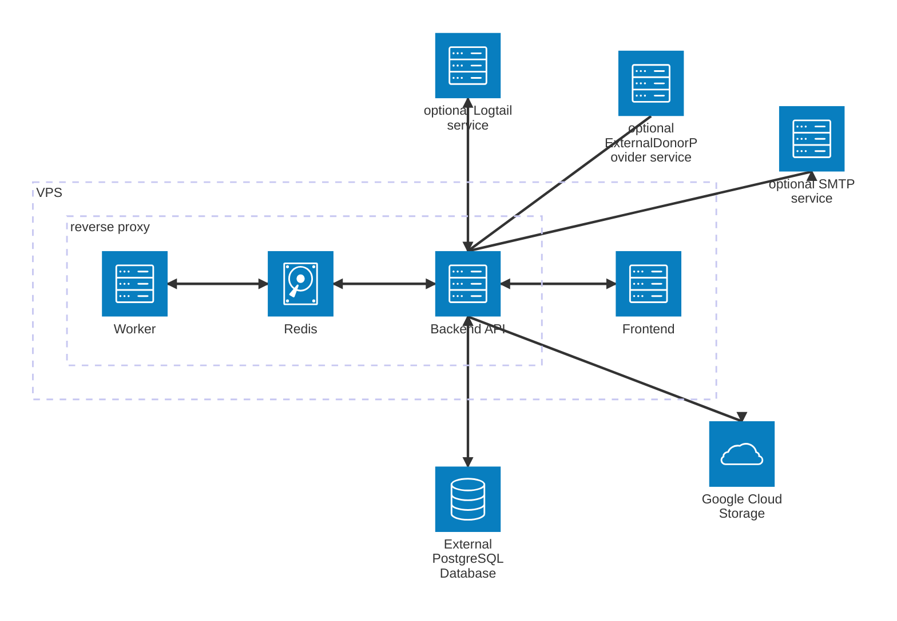

# Key Concepts & Architecture

## Core Concepts

### 1. Modular Service Design

- **Backend (`dms-api`)**: Built with NestJS, the backend handles business logic, API endpoints, background jobs (via a worker), and integrates with PostgreSQL, Redis, and Google Cloud. Optionally, it can connect to an external provider service for donor profile synchronization and event-driven updates.
- **Frontend (`dms-frontend`)**: Vue-based SPA, communicating with the backend via REST APIs, supporting authentication and (optionally) external provider integrations.
- **Shared Models**: TypeScript models unify data structures across backend and frontend, ensuring type safety and consistency.

### 2. Environment-Driven Configuration

- All critical behavior (database, cache, authentication, email, external integrations) is controlled via environment variables.
- The same codebase can be configured for local, demo, or production use by changing environment variables and .env files. This supports both direct and containerized deployments.

### 3. Authentication & Authorization

- JWT-based authentication, with support for access and refresh tokens.
- The app can run in read-only mode (no auth) or full mode (auth enabled), controlled by a single variable.
- Secure cookie handling and token lifetimes are configurable for different environments.

### 4. Data & Storage

- **PostgreSQL**: Primary data store, can be local (for dev) or external (for demo/prod).
- **Redis**: Used for caching and as a job queue, supporting both the main app and worker processes.
- **Google Cloud Storage**: Used for file storage, backups, and email templates, with credentials managed via service accounts.

### 5. Donor Sync & External Providers

- The system can sync donor data with an external profile management service, using event-driven updates and queue processing.
- Frontend and backend are both aware of the external provider, with conditional logic and variables to enable/disable this feature.

### 6. Email & Tax Receipts

- Automated email sending for annual tax receipts, with support for test mode and customizable templates.
- Tax receipt generation is highly configurable, supporting different templates and release schedules.

### 7. Logging & Monitoring

- Optional integration with Logtail for production-grade logging and monitoring.

## Architecture Diagram (Production Example)

---

[← Previous: Project Structure](03_project-structure.md) | [Next: Usage Guides →](05_usage-guides.md)
